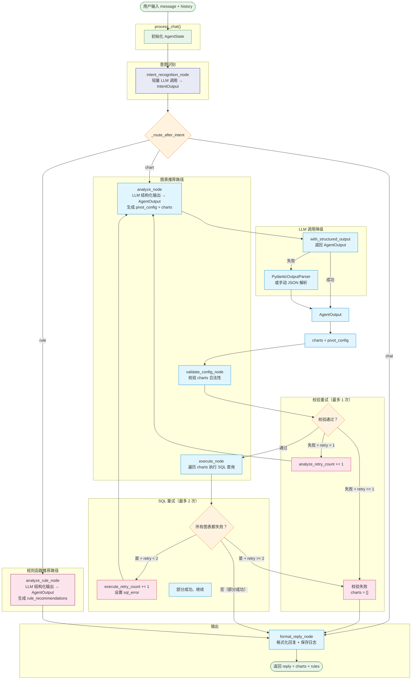

# Agent 流程图

## 路由说明

| 节点 | 出口 | 条件 | 去向 |
|------|------|------|------|
| **intent_recognition** | `chat` | 用户闲聊/问候 | **format_reply** |
| | `chart` | 用户想看数据/图表 | **analyze** |
| | `rule` | 用户想了解规则函数 | **analyze_rule** |
| **validate** | 通过 | charts 校验合法 | **execute** |
| | 重试 | 校验失败 + `analyze_retry_count < 1` | **analyze** |
| | 失败 | 校验失败 + `analyze_retry_count >= 1` | **format_reply** |
| **execute** | 重试 | 全部 SQL 失败 + `execute_retry_count < 2` | **analyze** |
| | 完成 | 部分成功或重试耗尽 | **format_reply** |

## 重试机制

- **validate 重试**：最多 **1 次**，校验失败时携带 `validation_error` 喂给 LLM 修正
- **SQL 重试**：最多 **2 次**，全表查询失败时携带 `sql_error` 喂给 LLM 修正
- 重试仍失败 → 前端显示友好提示

## 新增模型

### IntentOutput（意图识别输出）
- `intent`: `"chat" | "chart" | "rule"`
- `reason`: 判断原因

### RuleRecommendation（规则函数推荐）
- `rule_name`: 规则名称
- `rule_type`: 规则类型
- `description`: 功能说明
- `priority`: 推荐优先级
