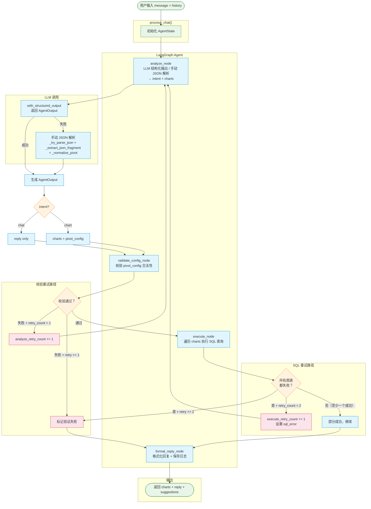

# Agent 流程图

## 路由说明

| 节点 | 出口 | 条件 | 去向 |
|------|------|------|------|
| **analyze** | → | 固定边 | **validate** |
| **validate** | `ok` | 校验通过 | **execute** |
| | `retry` | 校验失败 + `analyze_retry_count < 1` | **analyze**（重试） |
| | `fail` | 校验失败 + `analyze_retry_count >= 1` | **format_reply**（报错） |
| | `chat` | intent == chat（非图表请求） | **format_reply**（直接回复） |
| **execute** | `analyze` | 所有图表 SQL 失败 + `execute_retry_count < 2` | **analyze**（重试 + sql_error 反馈） |
| | `format_reply` | SQL 执行成功或重试耗尽 | **format_reply** |
| **format_reply** | → | 固定边 | **END** |

## 重试机制

- **validate 重试**：最多 **1 次**，校验失败时携带 `validation_error` 喂给 LLM 修正
- **SQL 重试**：最多 **2 次**，全表查询失败时携带 `sql_error`（含 SQL 错误原文）喂给 LLM 修正
- 重试仍失败 → 前端显示友好提示"图表生成失败，请尝试重新描述分析需求"
