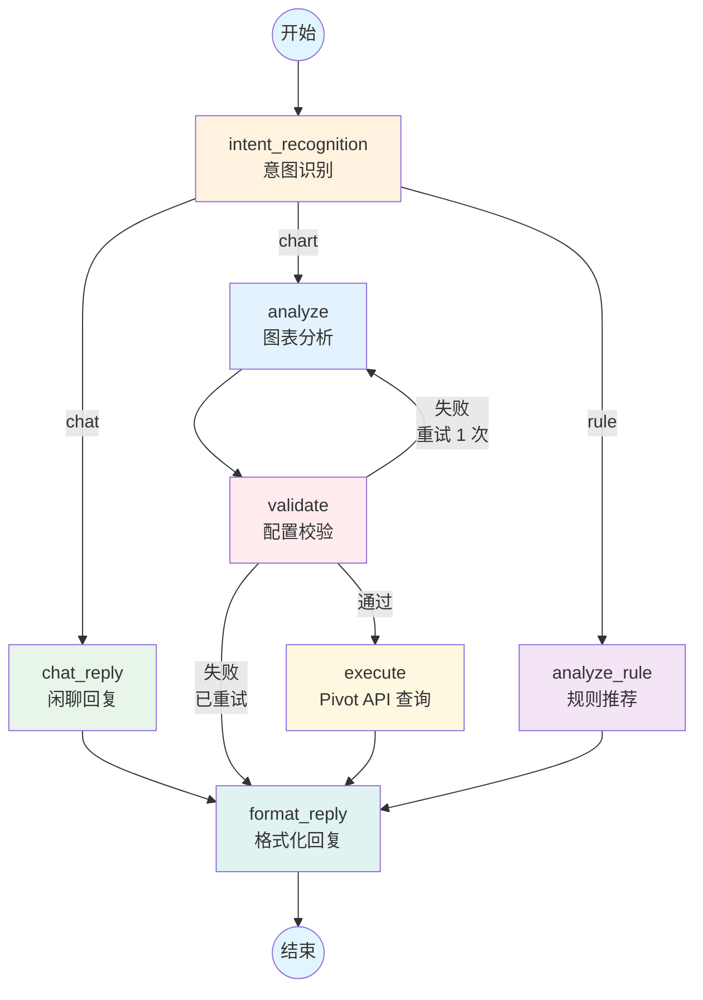

# LangGraph AI Agent 流程图

## 数据流架构



## 节点说明

| 节点 | 功能 | 输入 | 输出 |
|------|------|------|------|
| **intent_recognition** | 意图识别（chat/chart/rule） | 用户消息 + 对话历史 | 意图标签 |
| **chat_reply** | 闲聊模式：调用 LLM 生成自然回复 | 用户消息 + 对话历史 | 友好回复文本 |
| **analyze** | 图表分析：生成 PivotConfig 配置 | 用户消息 + 对话历史 | charts 列表 |
| **analyze_rule** | 规则函数推荐 | 用户消息 + 对话历史 | rule_recommendations |
| **validate** | 校验 charts 配置合法性 | charts 列表 | 通过/失败 |
| **execute** | 执行 Pivot API 查询 | PivotConfig | data + vega_spec + sql |
| **format_reply** | 格式化最终回复并保存日志 | 各节点结果 | 完整回复 |

## 路由逻辑

### 意图识别后路由
- `chat` → `chat_reply` → `format_reply`
- `chart` → `analyze` → `validate` → ...
- `rule` → `analyze_rule` → `format_reply`

### 校验后路由
- 通过 → `execute` → `format_reply`
- 失败且未重试 → 回流 `analyze`（最多 1 次）
- 失败且已重试 → `format_reply`（返回错误提示）

## 数据结构

### AgentState
```typescript
interface AgentState {
    user_message: string                    // 当前用户消息
    conversation_history: Array<{role, content}>  // 对话历史
    intent: "chat" | "chart" | "rule"       // 识别的意图
    charts: Array<{                          // 图表配置
        pivot_config: PivotConfig
        chart_type: string
        title: string
        data?: any[]
        sql?: string
        vega_spec?: any
        error?: string
    }>
    suggestions: string[]                   // 建议追问问题
    rule_recommendations: Array<{           // 规则推荐
        rule_name: string
        rule_type?: string
        description: string
        priority?: string
    }>
    reply: string                           // 最终回复
    error?: string                          // 错误信息
    analyze_retry_count: number             // 重试计数
    validation_error?: string               // 校验失败原因
    trace_log: Array<any>                   // 链路日志
}
```

## 关键特性

- ✅ **多轮对话支持**：每个节点都传入 conversation_history
- ✅ **结构化输出**：使用 Pydantic 模型保证 LLM 输出格式
- ✅ **配置校验**：charts 生成后自动校验，失败可重试
- ✅ **HTTP 执行**：通过 Pivot API 执行实际查询
- ✅ **链路追踪**：每个节点记录 trace_log，保存为 agent_{session_id}.json
- ✅ **错误处理**：LLM 调用失败时降级到手动 JSON 解析
