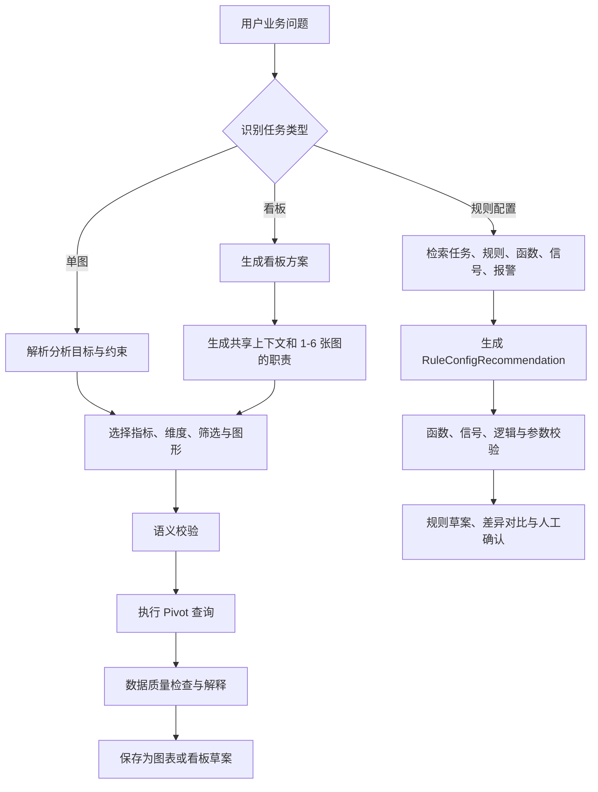

# 智能体能力差距与行动计划

> 评审日期：2026-07-13  
> 范围：图表推荐（单图、看板）和规则配置推荐。本文只基于当前仓库代码、SQLite 元数据模型及已暴露的接口评审，不假定外部 Pivot API 额外提供了未在仓库中声明的能力。

## 1. 目标定义与结论

### 1.1 目标能力

系统中的 Agent 应完成三类任务：

1. **单图推荐**：理解业务问题，选择合适的统计口径、维度、筛选和图表形态；执行查询后返回可解释、可编辑的单图。
2. **看板推荐**：围绕一个业务目标设计相互关联的多图分析路径，图表共享范围和过滤条件，并能落到可保存的看板。
3. **规则配置推荐**：基于当前任务、已有规则、可用函数、信号和报警表现，给出可核查的规则方案，包括函数、输入信号、判断逻辑、参数建议、适用范围与风险说明。

### 1.2 总体结论

| 能力 | 当前状态 | 结论 |
| --- | --- | --- |
| 单图推荐 | 已具备“自然语言 → PivotConfig → Pivot API → 图表”主链路 | **部分实现**。更接近图表配置生成，尚不是由业务目标和数据特征驱动的推荐。 |
| 看板推荐 | 可识别 `dashboard` 意图、返回问卷、允许 LLM 一次生成多图 | **部分实现且不稳定**。没有看板方案、图表间关系、共享过滤上下文或可靠的问卷续接。 |
| 规则推荐 | 有单独 Rule Agent 和规则/函数/信号参考接口 | **未达到目标**。Rule Agent 仅凭硬编码通用规则分类生成“名称/类型/说明/优先级”，不会读取当前任务、实际规则、函数、信号或报警。 |
| 规则配置推荐 | `ext_rules` 中已有表达式字段，`freeze_functions` 中已有函数资料 | **未实现**。没有规则配置领域模型、检索、生成、校验、展示或保存链路。 |

优先级应从“继续调 Prompt”转向“建立真实业务资产的检索、结构化推荐契约和可验证配置闭环”。

## 2. 现状证据与业务缺口

### 2.1 单图推荐：具备执行能力，缺少推荐决策层

当前图表 Agent 能产出 `PivotConfig`，经浅层校验后调用外部 Pivot API。`/api/recommend-chart` 也能基于已有 `PivotConfig` 推荐柱状、折线等图形。

但业务上仍有以下缺口：

- **推荐起点不完整**：用户描述的是业务问题时，系统没有先产出“分析目标、指标口径、时间范围、对比对象、推荐理由”，而是直接让 LLM 猜 PivotConfig。
- **图形推荐不看数据**：现有图形推荐只依据轴、图例和值的数量和字段名，不看执行后数据的基数、缺失率、时间连续性、占比集中度或样本量。因此“类别过多仍推荐饼图”等问题无法避免。
- **没有指标语义层**：如“报警次数”“违规率”“平均持续时长”没有统一定义。`alarm_time`、记录数、车辆去重数是否等价，全由模型临时判断。
- **没有可解释证据**：回复可说明“推荐柱状图”，但没有说明为何选此指标、为何选这些维度、数据是否足以支持该结论。
- **失败没有业务级修复**：Pivot API 报字段或聚合错误后只展示通用错误，不会改写配置或区分“无报警”“无数据”“筛选过严”“字段不可用”。

### 2.2 看板推荐：有多图输出，未形成分析方案

当前实现中，`dashboard` 意图会进入图表 Agent；模糊请求可触发问卷；LLM 也可以返回多个 `ChartItem`。

主要问题如下：

- **问卷答案丢失**：前端问卷只提交 `chart_count`、`task_id` 和每个槽位的文本。规则、信号仅可拖进自由文本，并不以规则 ID、信号名等结构化字段提交；提交时又只把任务名称和槽位文本拼成 `[问卷提交]` 消息。后端只能让 LLM 重新猜测选择结果。
- **未建立看板计划**：没有 `dashboard_goal`、共享筛选、共同时间范围、图表顺序、图表间下钻关系和每张图的业务职责。多个图只是一次 LLM 输出的列表，可能重复、指标口径不一致或互相矛盾。
- **图表数没有后端约束**：产品约定每个看板最多 6 图，但 Agent 输出和后端没有强制上限、去重或最低有效图数校验。
- **不能可靠续接**：`pending_step` 被保存，但没有面向会话的结构化 `pending_context`；重启、编辑问卷、追问“第二张换折线图”时没有稳定的计划状态。
- **没有落库闭环**：Agent 返回的多图不会自动形成 `board` 草案、布局或共享筛选，仍需用户逐张保存。

### 2.3 规则配置推荐：数据资产存在，Agent 未使用

仓库已有可利用的业务资料：

- `ext_tasks`：任务及状态、时间、优先级等；
- `ext_rules`：规则名称、说明、开始/结束/判断表达式、转换表达式、参数、规则信号等；
- `freeze_functions`：函数名称、参数、返回值、示例、类型和适用上下文；
- `/api/functions/tasks`、`/rules`、`/signals`：供界面选取参考数据。

然而 Rule Agent 的系统提示词写死了“超速、急刹、电子围栏”等通用分类，未查询上述任何表。其结构化输出只包含：`rule_name`、`rule_type`、`description`、`priority`。

因此当前系统无法回答下列核心业务问题：

- “任务 A 的横向控制报警较多，应该如何调整或新增规则？”
- “当前规则已经覆盖哪些信号？还缺哪些关键诊断信号？”
- “请用现有函数给出一个 SOC 快速下降规则的开始条件、判断条件、结束条件和参数建议。”
- “这个推荐是新建规则、调整现有规则，还是已有规则可直接复用？依据是什么？”

此外，`/api/functions/signals` 依赖 `signal_stats`，但当前仓库没有该表的建表、导入或刷新逻辑。即使外部环境偶然存在该表，数据来源、更新时间、`alarm_count` 口径也未被定义；规则推荐不能依赖此不确定数据源。

### 2.4 前端和接口承接缺口

- `ChatResponse` 虽返回 `rules`，但前端 `ChatMessage` 和消息渲染未保存/展示该字段；规则结果只能被拼进普通回复文本。
- 函数管理接口目前只有查询、删除、恢复等能力；没有“按业务场景检索函数”“函数兼容性校验”或“函数版本”能力。
- 没有规则草案 API：无法保存推荐方案、比较已有规则、标记采用/拒绝、提交人工审批。
- Trace 能记录调用过程，但没有“推荐是否被采用”“配置是否通过校验”“上线后报警效果”等业务反馈指标，无法迭代推荐质量。

## 3. 目标业务流程



原则：LLM 负责理解、选择和解释；任务/规则/函数/信号的存在性、关系、参数格式、配置约束和最终落库由确定性服务负责。

## 4. 可执行行动项

### P0：让规则推荐真正基于业务资产（必须先完成）

#### A1. 建立规则配置推荐的领域契约

**要做什么**

新增 Pydantic 模型 `RuleConfigRecommendation`，替代当前只含名称和说明的 `RuleRecommendation`。建议最少包含：

```json
{
  "recommendation_type": "new_rule | adjust_existing | reuse_existing | insufficient_data",
  "business_goal": "识别 SOC 在短时间内异常下降",
  "task": {"id": 123, "name": "..."},
  "evidence": {
    "existing_rule_ids": [456],
    "signal_names": ["soc", "vehicle_speed"],
    "alarm_summary": {"period": "...", "count": 0, "source_status": "available"}
  },
  "proposed_rule": {
    "name": "SOC 快速下降报警",
    "description": "...",
    "start_condition": {"function": "...", "args": []},
    "judge_condition": {"operator": "AND", "children": []},
    "end_condition": {"function": "...", "args": []},
    "signals": [{"name": "soc", "role": "primary", "required": true}],
    "parameters": [{"name": "drop_threshold", "value": 15, "unit": "%", "rationale": "..."}],
    "window": {"before_seconds": 30, "after_seconds": 30}
  },
  "validation": {"status": "valid | needs_confirmation | invalid", "issues": []},
  "citations": [{"type": "task | existing_rule | function | signal", "id": "...", "label": "..."}],
  "assumptions": []
}
```

**修改位置**：`backend/models/pivot_config.py`（或新建 `backend/models/rule_recommendation.py`）；`ChatResponse` 增加 `rule_recommendations` 字段。

**验收标准**

- 任一规则推荐都能区分“新建/调优/复用/资料不足”；
- 所有函数、信号、已有规则都携带稳定 ID 或名称引用；
- 不能生成只有自然语言说明、没有结构化逻辑的“规则配置推荐”。

#### A2. 建立规则知识检索与关系服务

**要做什么**

实现 `RuleKnowledgeService`，由 Rule Agent 在 LLM 前调用，输入 `message + task_id（可选）`，输出受限上下文：

1. 解析/消歧任务：优先显式 `TASK_ID`，否则检索任务名称并在多候选时提问；
2. 获取任务下所有 `ext_rules`，包括表达式、参数、`RULE_SIGNALS` 和 `OTHER_SIGNALS`；
3. 按场景关键词从 `freeze_functions` 检索函数；
4. 聚合该任务关联信号和报警统计；
5. 返回资料版本、数据时间范围和缺失项，禁止 Agent 把缺失资料当作事实。

**修改位置**：新建 `backend/services/rule_knowledge.py`、`backend/services/rule_validator.py`；重构 `backend/agents/rule_agent.py`。

**验收标准**

- 对指定任务的推荐只能引用该任务可见的已有规则和已检索到的函数/信号；
- 查不到任务、函数或报警时返回 `insufficient_data` / 澄清问题，不编造；
- Trace 可看到检索到的实体 ID、数量和版本，不记录无关全库数据。

#### A3. 补齐并定义报警/信号统计数据源

**要做什么**

- 明确 `signal_stats` 的表结构、来源、刷新方式和 `alarm_count` 统计周期；若其为外部数据，则通过同步任务导入 SQLite 或定义稳定 API 客户端。
- 至少提供：`task_id`、`rule_id`、`signal_name`、统计周期、报警数、样本数、最后更新时间、数据质量状态。
- `RULE_SIGNALS` / `OTHER_SIGNALS` 的字符串格式要在导入时解析为关系表 `rule_signals`，避免每次由 LLM 或字符串匹配解释。

**修改位置**：`backend/core/chat_db.py`（迁移和导入）、新建数据同步/刷新服务、`backend/routers/api_functions.py`。

**验收标准**

- 新环境初始化后 `/api/functions/signals?task_id=...` 不依赖手工创建表即可工作；
- UI 和 Agent 能显示“统计截至时间”和“无报警/无数据”的区别；
- 可以从任一信号反查关联规则和任务。

#### A4. 增加规则配置校验器

**要做什么**

在保存或返回推荐前执行确定性校验：函数存在且未删除、参数名/类型/范围匹配、主信号存在、信号属于任务或明确标注跨任务、开始/判断/结束逻辑完整、表达式深度与操作符受支持。

**验收标准**

- 不存在的函数、信号或规则 ID 必须被拒绝；
- 不完整推荐必须包含可操作的 `issues`，而非继续输出“推荐成功”；
- 校验用例覆盖 AND/OR/NOT、阈值、持续时长、窗口等逻辑。

### P0：修复看板问卷到推荐的业务数据链路

#### A5. 用结构化看板草案取代 `[问卷提交]` 文本

**要做什么**

- 前端提交 `DashboardRequestDraft` JSON：`task_id`、选中 `rule_ids`、`signal_names`、时间范围、业务目标、每个槽位的描述和偏好图形。
- 后端将草案保存到会话的 `pending_context_json`（或独立 `agent_drafts` 表），返回 `draft_id`；后续编辑携带该 ID。
- 将规则/信号从“仅可拖入文本”改为可选 Chip，保留 ID 和显示名。

**修改位置**：`AskQuestionsPanel.vue`、`AIDialog.vue`、`useChatStore.ts`、`api_chat.py`、`chat_db.py`；新增草案模型和迁移。

**验收标准**

- 后端收到的看板草案可完整还原用户选择，不依赖从中文文本反解析；
- 用户编辑第 2 张图不影响其他图；
- 重新进入会话后可以继续编辑未完成草案。

#### A6. 引入看板方案模型与模板

**要做什么**

新增 `DashboardRecommendation`：业务目标、共享过滤器、共同时间范围、1–6 个 `ChartRecommendation`、每张图的职责（总览/趋势/分布/排行/明细）、推荐原因、图间下钻关系和布局建议。

先落地 3 个模板：

1. **报警总览**：报警趋势 → 规则分布 → 车型/车辆排行 → 时段分布；
2. **任务规则诊断**：规则报警趋势 → 高报警信号 → 规则/信号明细 → 数据质量；
3. **单规则分析**：规则趋势 → 关联信号时序 → 车辆/任务分布 → 报警明细。

LLM 只选择/参数化模板；模板服务负责生成基础 PivotConfig 和共享筛选，避免多图指标口径漂移。

**验收标准**

- 后端强制图表数为 1–6；
- 同一看板的任务、时间范围和报警口径一致，除非某张图明确声明例外；
- 每张图都有不重复的分析职责和可解释推荐理由；
- 可将方案一次性保存为 board + charts 草案。

### P1：使单图推荐成为业务驱动推荐

#### A7. 增加分析计划与指标字典

**要做什么**

在生成 `PivotConfig` 前增加 `ChartRecommendation` / `AnalysisPlan`：业务问题、指标定义、分组维度、过滤范围、图形选择原因、需要用户确认的假设。建立指标字典，明确“报警次数、报警车辆数、平均持续时长、报警率”等 SQL/Pivot 映射和适用字段。

**验收标准**

- 回答“各车型报警情况”时，系统能追问或默认声明是“报警记录数”还是“去重车辆数”；
- 图表返回结果中可查看指标口径；
- 所有模板和 Agent 共用同一指标定义。

#### A8. 让图形选择基于执行后数据

**要做什么**

保留当前规则型 `/api/recommend-chart` 作为预推荐；在 Pivot 返回数据后计算数据画像（行数、类别基数、时间连续性、零值率、正负值、Top-N 集中度），再确认或调整图形及排序/Top-N。

**验收标准**

- 类别数过多时不推荐饼图；
- 有时间断点时明确提示，不把断点趋势误导为连续趋势；
- 无数据时返回明确原因和可点击的放宽筛选建议。

#### A9. 增加执行错误的定向修复和结果解释

**要做什么**

将 Pivot 错误归类为字段、聚合、时间粒度、筛选值、超时五类；仅允许一次“错误摘要 → 修复配置 → 再校验 → 再执行”。执行成功后生成确定性摘要（数据量、最大/最小项、时间范围）；LLM 若需要补充解释，只使用摘要而不读取整表明细。

**验收标准**

- 常见字段/聚合错误可自动修复一次；
- 不向用户泄露底层 SQL/内部异常；
- 返回的解释与图中数据一致且可追溯。

### P1：补齐用户可见的规则推荐闭环

#### A10. 新增规则推荐卡片、差异对比与草案保存

**要做什么**

- 前端将 `rule_recommendations` 渲染为结构化卡片：适用任务、证据、函数、信号、条件树、参数、风险和校验结果；
- 支持与已有规则的差异视图（新增/修改哪些条件、信号或阈值）；
- 新增规则草案的保存、导出 JSON、人工确认/驳回和审批状态。不要直接写入运行中的外部规则系统。

**验收标准**

- 用户无需从大段文本中手工提取规则逻辑；
- 每份草案可追溯到推荐时的任务、规则、函数和数据版本；
- “采用推荐”只创建草案，必须经人工确认才能发布。

#### A11. 为规则建议增加反馈和效果评估

**要做什么**

记录推荐被查看、保存、修改、采用、拒绝的原因；对发布后的规则记录报警量、有效/误报反馈、信号覆盖度，以支持后续优化排序。

**验收标准**

- 可按任务/场景看到推荐采纳率；
- 能比较“调整前后”报警数量和人工确认质量；
- 推荐排序可先采用规则化反馈加权，暂不需要直接在线学习。

### P2：平台可靠性与质量保障

#### A12. 重构 Agent 调度与运行时

**要做什么**

- 将同步 LLM / `requests` 调用改为异步调用；看板中的 Pivot 查询采用有限并发；
- 图执行器与 Agent 编排解耦，设置连接/读取超时、取消和重试策略；
- 缓存按字段/任务/规则版本失效，避免进程启动后的静态 Prompt 长期过期；
- 过滤传入 LLM 的历史消息，仅传递角色、文本和结构化摘要，不直接传递任意扩展字段。

**验收标准**

- 六图看板不会因串行请求把总体等待时间线性放大；
- 任务/规则/函数变更后无需重启即可被推荐服务使用；
- 高并发下 FastAPI 事件循环不被同步请求阻塞。

#### A13. 建立离线评测集和上线门禁

**要做什么**

准备至少 60 条脱敏用例：20 条单图、20 条看板、20 条规则配置推荐；每条定义期望任务、可引用信号/函数、禁止引用项、所需澄清问题和验收规则。将结构校验、检索一致性和 Pivot 执行纳入自动测试。

**核心指标**

| 指标 | 初期目标 |
| --- | --- |
| 单图配置一次通过率 | ≥ 85% |
| 看板中图表职责不重复率 | ≥ 90% |
| 规则推荐实体引用有效率 | 100% |
| 规则推荐出现编造函数/信号的比例 | 0% |
| 规则草案结构校验通过率 | ≥ 95% |
| 用户需人工重写的推荐比例 | 持续下降并按场景统计 |

## 5. 建议实施顺序

| 阶段 | 行动项 | 产出 | 依赖 |
| --- | --- | --- | --- |
| 第 1 阶段 | A1、A2、A3、A4 | 可检索、可校验的规则配置推荐 API | 明确函数与信号数据源 |
| 第 2 阶段 | A5、A6 | 结构化看板草案和 3 个看板模板 | 第 1 阶段的数据关系服务 |
| 第 3 阶段 | A7、A8、A9 | 有口径、可解释、可修复的单图/看板图表推荐 | 指标字典、Pivot API 能力确认 |
| 第 4 阶段 | A10、A11 | 规则草案 UI、审批和反馈闭环 | 第 1 阶段 API 契约 |
| 持续进行 | A12、A13 | 性能、可观测性和质量门禁 | 各阶段功能完成后纳入 |

## 6. 首个迭代建议（两周范围）

首个迭代不要尝试直接生成可发布规则，而应完成可验证的“规则建议草案”。

1. 定义并返回 `RuleConfigRecommendation`；
2. Rule Agent 在调用 LLM 前按 `task_id` 获取 `ext_rules`、`freeze_functions`，并将检索结果作为唯一可引用上下文；
3. 新建 `signal_stats` 的迁移/同步最小实现，或在数据不可用时明确返回“报警统计不可用”；
4. 实现函数、信号、逻辑树的校验器；
5. 前端展示规则建议卡片和校验问题，不做自动发布；
6. 增加 10 条真实场景的回归用例。

完成后，系统才具备“针对当前任务给出有证据、可查看、可校验的规则配置建议”的最小产品闭环；再扩展到看板模板和数据驱动图形推荐，风险最低。

## 7. 相关现有实现索引

- 意图路由：`backend/agents/pivot_agent.py`
- 单图/看板 Agent：`backend/agents/chart_agent.py`
- 当前规则 Agent：`backend/agents/rule_agent.py`
- Pivot 数据模型：`backend/models/pivot_config.py`
- 任务、规则、函数元数据：`backend/core/chat_db.py`
- 任务、规则、信号参考接口：`backend/routers/api_functions.py`
- 图形类型规则推荐：`backend/routers/api_recommend.py`
- 看板问卷：`frontend/src/components/AskQuestionsPanel.vue`
- 问卷提交转换：`frontend/src/components/AIDialog.vue`
